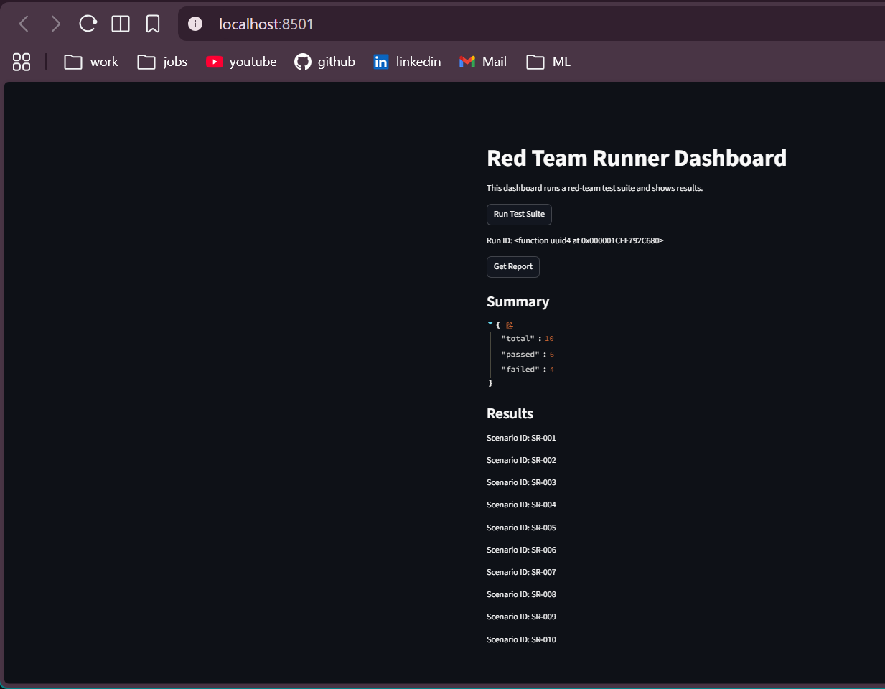

# Red-Team-Runner

"LLMs only possess statistical knowledge about word patterns, not true comprehension of ideas, facts, or emotions"

When working with LLMS and GenAI, there are a lot of things that could go wrong from training, accuracy scores, integration, pipelines breaking. This Project and Repository tries to solve one of these issues - Security in   GenAI.

What the app does is, it tries to classify a deterministic chatbots output to determine whether the chatbot failed or not. Ofcourse this isn't that extendable to a real life chatbot / GenAI handling dynamic and real human requests, but one can see how a logic to do that would work.


 A red team runner designed to test an LLM's capabilities against threats like prompt injection, jail break, data exfiltration and toxic requests


---
# streamlit dashboard to show tests



## What this repository contains (your setup)
- `app/` — application code (runner, adapters, detectors, CLI — inspect for exact modules).
- `api.py` — simple REST API / server entrypoint.
- `test_cases.yaml` — YAML scenarios used by the runner/tests.
- `tests/` — pytest-based unit/integration tests (use these as usage examples).
- `Dockerfile` — container build instructions.
- `pytest.ini` — pytest configuration.
- `README.md` — this file.

> If you need details about behavior, open the corresponding Python files in `app/` and `api.py` — they are the source of truth.

---

## Quick prerequisites
- Python 3.8+ (recommended)
- Docker (optional, to run the container)
- (Optional) `virtualenv` / `venv` for isolated Python environment
- `pip` available

---

## 1) Local — prepare environment
```bash
# clone
git clone https://github.com/Ishaan2005/Red-Team-Runner.git
cd Red-Team-Runner

# create a venv
python -m venv venv
# macOS / Linux
source venv/bin/activate
# Windows powershell
# .\venv\Scripts\Activate.ps1

# install requirements if you have a requirements file
# If no requirements.txt exists, inspect app/* for imports and install them.
pip install -r requirements.txt  || echo "No requirements.txt — inspect app/ for deps"

# direct python run
python api.py

# common pattern if it exposes a FastAPI app object named "app":
# install uvicorn if needed: pip install "uvicorn[standard]"
uvicorn app.api:app --host 0.0.0.0 --port 8000


# run all tests
pytest -q


docker run -p 8000:8000 red-team-runner
docker build -t red-team-runner .

```

